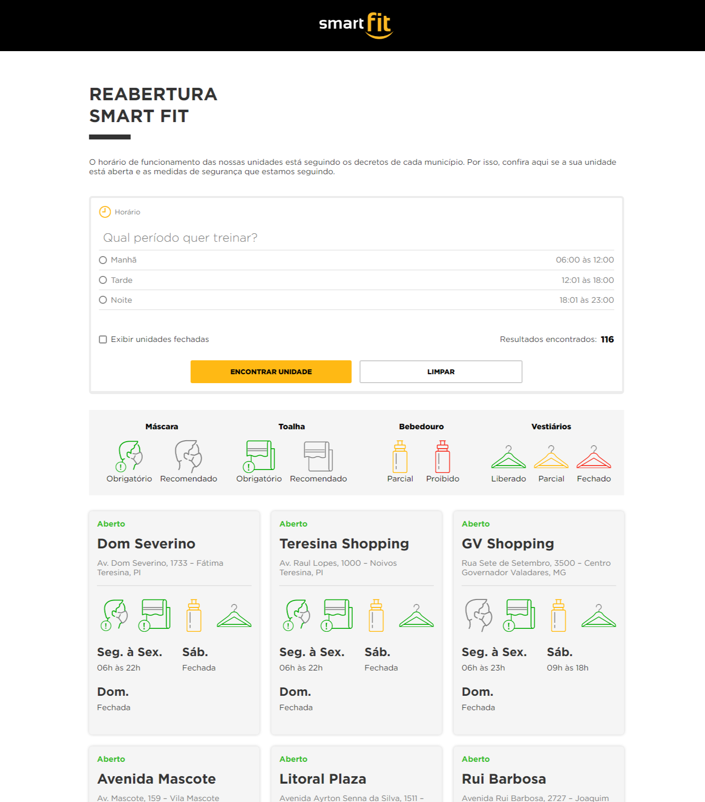

# Front-end Challenge - Smart Fit

This repository captures my take on the Front-end challenge provided by Smart Fit, a project tailored to assess my technical skills for the Front-end role.

## Preview

## Challenge Proposal

Smart Fit, being deeply intertwined with the fitness industry, underwent significant shifts during the pandemic. This project's focus is on crafting a page for scouting Smart Fit units, whether **closed** or **open**, facilitating consultation and reservations.

In tackling this test, I endeavored to implement the stipulated functionalities while being mindful of the outlined business rules. The overall aim was to adhere to the provided material, ensuring a responsive and visually appealing design.

### Functionalities

- **Data Fetching:** Loaded unit data locally using the `GET` method from the locations.json file in the project directory. This local file serves as a mock data source, facilitating rapid development and testing.
- **Search:** Implemented the ability to search for all units and apply filters.
- **Unit Display:** Dynamically displayed units while searching, adhering to the provided layout.

### Business Rules

- **Filtering:** Implemented filters for open/closed units and operating hours.
- **User Feedback:** Incorporated user-friendly messages, such as "No units found" when applicable.
- **Icon Validation:** Ensured correct icons were displayed based on the unit's status.

### Tech Stack

- **TypeScript:** Leveraged TypeScript for enhanced code quality and maintainability.
- **Vite:** Utilized Vite for fast and efficient development and building.
- **React.js:** Employed React.js for building the user interface with its component-based architecture.
- **SASS:** Styled the components with SASS for maintainable and modular styling.

## How to Run Locally

To explore the project on your machine:

1. Clone this repository.
2. Navigate to the project directory.
3. Install dependencies using `npm install`.
4. Run the application with `npm run dev`.

## Delivery

You can view the working app on [Vercel](https://smartfit-challenge-rgomes98.vercel.app/).

## Evaluation

In my approach to this challenge, I prioritized:

- **Programming Logic:** Demonstrating problem-solving skills.
- **Code Quality:** Maintaining high standards for clean, readable, and maintainable code.
- **Delivery Quality:** Ensuring the project is production-ready.
- **Layout Fidelity:** Staying true to the proposed layout.
- **Responsive Design:** Prioritizing responsiveness across various devices.

---

_Feel free to explore the live demo and the codebase. I'm eager to hear your feedback!_
